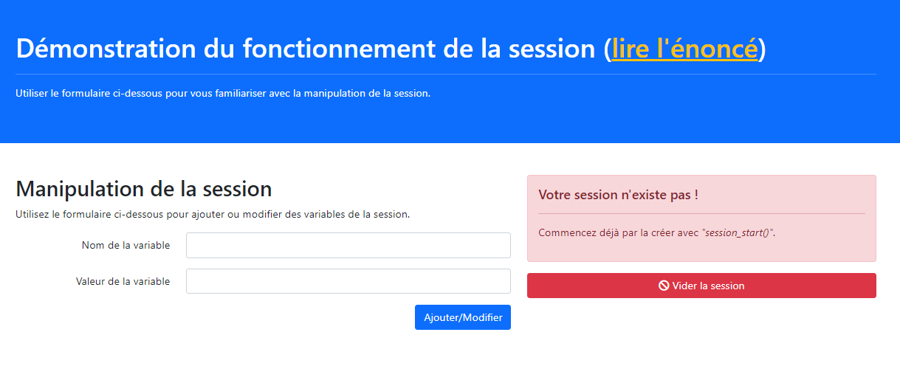

###### PHP - programmation avancée
# Les sessions PHP

## Théorie

Lorsque vous utilisez une application sur un ordinateur, vous la lancez, vous vous promenez dedans et intéragissez autant que vous le souhaitez, puis vous la fermez. L'ordinateur *"sait"* à tout moment qui vous êtes. Sur un autre ordinateur, une autre personne pourra utiliser la même application ; vos données et interactions respectives ne se mélangeront pas.

Ceci n'est pas possible avec un serveur web car le serveur est le même pour tout le monde. Rien ne lui permet de différencier vos demandes de celles d'une autre personne. En tout cas, pas sans utiliser les sessions PHP. 

Dit autrement : d'une page à l'autre, le serveur *"oublie"* qui vous êtes, et donc, ne peut pas vous différencier d'un autre utilisateur.

La session PHP permet de garder la *"mémoire"* de certaines informations que l'on choisi d'y stocker. On peut voir cela un peu comme des *"variables globales"* qui sont tellement globales qu'elles existent d'une page à l'autre.

## De l'utilité des sessions

Du coup, à quoi ça sert nous direz-vous ? Et bien, c'est l'élément clé qui rend possible la connexion d'un utilisateur.

En effet, à quoi bon demander à une personne ne saisir son email et son mot de passe, ou d'utiliser tout autre système d'identification qui pourrait vous venir à l'esprit, afin de se connecter à votre site si, dès la page suivante votre serveur ne se souvenait plus de cette personne.

La session va vous permettre de stocker une information unique sur votre utilisateur, par exemple son adresse email ou un id unique, et de ressortir cette info à la page suivante, et, du coup, d'aller chercher en base de données toutes les autres infos de l'utilisateur.


Ci-dessus, une représentation, succinte mais relativement fidèle, d'un système de connexion des plus classiques.

**1.** Le PHP de la page de connexion récupère l'email et le mot de passe saisis par l'utilisateur et demande à la base de données si cet utilisateur existe bel et bien.
**2.** Si l'utilisateur existe, la base de donnée renvoie son identifiant unique qu'ici nous appelerons *"uid"*.
**3.** La page de connexion, après vérification, stocke l'uid dans la session pour qu'il puisse y être retrouvé plus tard.
**4.** L'utilisateur peut aller sur n'importe quelle page du site et choisit d'aller sur sa page de profil. Celle-ci va récupérer l'uid dans la session.
**5.** La page profil, munie de l'uid, demande à la base de données quelles sont les datas associées à cet uid.
**6.** La base de données restitue les données de l'utilisateur qui sont ensuite affichées par la page de profil.


## Comment ça marche 

### Initialisation de la session PHP

Pour pouvoir utiliser la session PHP, il d'abord faut démarrer la session dans la page. Pour cela, on utilise l'instruction [session_start()](https://www.php.net/manual/fr/function.session-start.php) au tout début de son PHP.

> ⚠️ Il est très important de bien placer l'appel à [session_start()](https://www.php.net/manual/fr/function.session-start.php) au tout début de son code. 
Pour des raisons de sécurité qu'il serait trop long et compliqué de détailler ici, la création de session est interdite lorsque le transfert de HTML a commencé. 
Dit autrement, si vous faites quelque part un ```echo```, ou si vous chargez du PHTML, ou si vous faites quoique ce soit qui commence à envoyer ne serait-ce qu'un seul caractère au navigateur et que vous faites, seulement ensuite, appel à [session_start()](https://www.php.net/manual/fr/function.session-start.php), cet appel sera refusé avec un bon gros message d'erreur bien sale.

En bref : faites simple. Si vous voulez utiliser les sessions sur votre site, commencez toutes vos pages par :

```PHP
<?php
session_start(); // Initialisation de la session
```

### Utilisation de la session

L'utilisation de la session est super simple en PHP, c'est juste une super globale, comme [\$_GET](https://www.php.net/manual/fr/reserved.variables.get) et [\$_POST](https://www.php.net/manual/fr/reserved.variables.post) mais qui s'appelle [\$_SESSION](https://www.php.net/manual/fr/reserved.variables.session) (N.D.R. : *Ouai, les mecs se sont clairement défoncés pour trouver ça... et ils sont très bien payés en plus.*).

Du coup, lorsque vous voulez, après avoir correctement initialisée votre session, enregistrer une valeur en sessio, pour la ressortir plus tard, vous avez juste à écrire quelque chose comme (si on garde l'exemple précédent) : 

```PHP
$_SESSION['uid'] = $uid;
```

Puis, dans le PHP d'une autre page du site, pour *"ressortir"* cette valeur :

```PHP
$uid = $_SESSION['uid'];
```

Simple, direct, efficace.

### Terminer la session


En vérité, il n'est pas utile, à proprement dit, de *"terminer"* la session, dommage pour Arnold mais cela n'a aucun intéret réel pour nous et ne fait même que rendre le code plus complexe.

Lorsque l'on veut en finir avec la session, c'est à dire déconnecter l'utilisateur, il suffit *"d'oublier"* tout ce que l'on sait de lui avec la commande [session_unset()](https://www.php.net/manual/fr/function.session-unset) comme suit :

```PHP
session_unset(); // Détruit toutes les variables enregistrées en session
```

Là aussi, c'est très simple. 

La variable [\$_SESSION](https://www.php.net/manual/fr/reserved.variables.session), de fait, existe toujours, mais elle est vide et, par conséquent, d'une page à l'autre le serveur *"oublie"* qui est l'utilisateur, qui est donc considéré comme étant déconnecté.

## Au boulot !

Vous allez réaliser un petit outil d'expérimentation avec la session. 

**Celui-ci est très simple :**



- À gauche un formulaire qui permet d'ajouter n'importe quelle data dans la session
- À droite  :
    - Un message nous disant que nous n'avons pas de session, ce message peut-être modifié via le PHP.
    - En dessous, mais invisible pour le moment, la liste de toutes les datas se trouvant en session.
    - Encore en dessous un bouton pour vider complètement les infos de la session.

**Le resultat attendu :**


**On voit bien :**
- à droite : le tableau rempli de données, celles-ci provenants de la session. 
- au-dessus : le message personnalisé à destination de l'utilisateur.


> Note : pour information, lorsque la capture d'écran a été faite, les données étaient encore en session plusieurs heures après y avoir été stockées, alors même que le navigateur avait été fermé et l'ordinateur éteint. Comme quoi ces données dites *"persitantes"* ont bien été *gardées en mémoire* par le serveur.

**Quelques instructions et conseils importants :**

- Vous devez juste travailler dans le fichier ***"index.php"*** et rien d'autre.
- Le code est entièrement détaillé avec du ***"pseudo-code"*** en commentaire, vous ne devriez avoir aucune difficulté.
- Procédez par étape et développez d'apport l'étape indiquée par ```01``` avant de passer à la suivante.
- les messages personnalisés à afficher à l'utilisateurs sont :
    - *La variable **NOM** a été ajoutée à la session, sa valeur est **VALEUR**. Utilisez le même nom pour la modifier*
    - *La session a été vidée. Elle existe toujours mais, puisqu'elle est vide, on considère que l'utilisateur est déconnecté.*
    - *La variable **NOM** a été supprimée de la session.*

**Étapes :**
- **01** : Initialiser la session
- **02** : Implémenter la demande d'ajout via le formulaire (en POST)
- **03** : Implémenter le vidage complet de la session lors d'un clic sur le lien *"Vider la session"* (simple GET)
- **04** : Implémenter la suppression d'une seul variable de session lors d'un clic sur la corbeille (simple GET là aussi)

## Ce dont vous aurez besoin

- **$_POST** : https://www.php.net/manual/fr/reserved.variables.post
- **$_GET** : https://www.php.net/manual/fr/reserved.variables.get
- **$_SESSION** : https://www.php.net/manual/fr/reserved.variables.session
- **session_start()** : https://www.php.net/manual/fr/function.session-start.php
- **session_unset()** : https://www.php.net/manual/fr/function.session-unset.php
- **isset()** : https://www.php.net/manual/fr/function.isset
- **unset()** : https://www.php.net/manual/fr/function.unset
